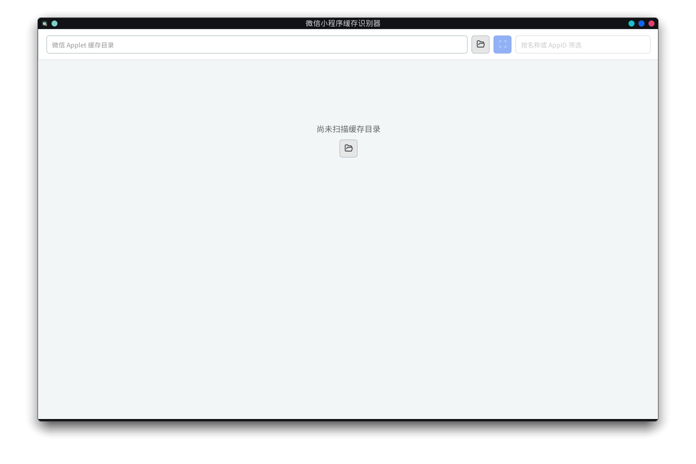

# 微信小程序缓存识别器

[](https://github.com/cnlnn/wxapplet-inspector/actions/workflows/cross-platform.yml)



纯 Rust 跨平台桌面应用，用于扫描微信 `Applet` 缓存、从主包提取小程序名称、查看插件依赖并批量解压 `wxapkg`。

## 功能

- 扫描微信 `Applet` 缓存并识别小程序名称、AppID、版本、包数及时间信息
- 按名称、AppID、版本、大小和日期排序或筛选
- 展示小程序与插件、运行时包之间的依赖关系
- 多选并批量解压主包，支持取消和部分失败报告
- 点击名称或 AppID 复制，点击目录按钮直接定位缓存或输出目录
- 识别过程完全在本地执行，不通过 AppID 查询网络服务，也不内置 AppID 到名称的硬编码表

## 使用

从 [Actions](https://github.com/cnlnn/wxapplet-inspector/actions) 下载对应平台的构建产物，或从源码构建。启动后选择微信缓存中的 `Applet` 目录并扫描。

名称来自主包内的结构化配置和程序文本。缓存不完整、仅存在分包或主包内容经过额外保护时，名称可能显示为未识别；程序不会为了填充名称而猜测或联网查询。

## 开发与测试

```sh
cargo run
cargo test
cargo clippy --all-targets -- -D warnings
```

使用真实缓存运行完整名称回归：

```sh
WXAPPLET_ROOT=/path/to/.xwechat/radium/Applet cargo test \
  cache::tests::all_known_names_regress_together_when_configured -- --nocapture
```

## 构建

```sh
cargo build --release
./packaging/linux/build-appimage.sh
```

图标源文件为 `assets/icon.svg`。修改后运行 `./packaging/generate-icons.sh`，
同步生成 Linux/运行时使用的 PNG、Windows ICO 和 macOS ICNS。

Linux 同时支持 X11 和 Wayland。

GitHub Actions 会在 Linux x86_64、Windows x86_64、macOS Intel 和 macOS Apple Silicon 上执行测试、Clippy 检查并生成安装包。推送 `v*` 标签时会自动创建 GitHub Release。

## 隐私

程序不会上传缓存内容、AppID、识别结果或解压文件。缓存读取和主包解压均在本机完成。
